# 2026 新西兰滑雪旅行攻略

**出发地**：深圳  
**建议日期**：2026-08-15（周六）— 2026-08-25（周二）  
**核心目的地**：奥克兰、皇后镇、瓦纳卡、米尔福德峡湾  
**滑雪重点**：Coronet Peak、The Remarkables、Cardrona、Treble Cone  
**适用人群**：2 人情侣；5 人组合（情侣 + 一家三口，按 4 成人 + 1 儿童估算）  
**价格口径**：雪票/交通按 2026-06-21 检索信息整理；住宿与汇率按 2026-06-25 可公开读取价格整理。住宿平台多显示 USD，换算按 `1 USD ≈ ¥6.81`、`1 NZD ≈ ¥3.85` 粗算；深圳往返奥克兰国际机票以实际看到价格 `F/人` 单独计。

> 预订原则：先签证，再订不可退项目。酒店优先订可取消；雪票和内陆机票在签证与国际段明确后再锁。文档中的雪道图优先使用官方地图资源；出发前仍需以雪场官网和 App 当天信息为准。

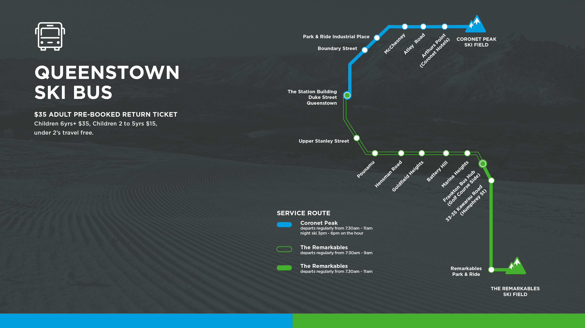

*图：NZSki 官方皇后镇雪场交通地图，适合理解 Queenstown、Coronet Peak、The Remarkables 和主要接驳点之间的位置关系。来源：NZSki 官方媒体资源。*

---

## 1. 行程结论

### 为什么选 8/15–8/25

- **雪质**：皇后镇官方说明 7–8 月通常是雪况最佳的冬季高峰；Cardrona/Treble Cone 也说明 8 月通常是降雪更集中的月份。
- **性价比**：你看到的深圳往返奥克兰机票便宜，且 `8/17–8/21` 正好是工作日滑雪，避开周末雪场人流。
- **路线效率**：奥克兰只作为国际转机点，主要时间放在南岛皇后镇和瓦纳卡。
- **风险控制**：最后一晚住奥克兰机场附近，不用在冬季当天从皇后镇接国际航班。

### 推荐节奏

- **滑雪**：4 个完整滑雪日 + 1 个天气/体力缓冲日。
- **观光**：Arrowtown、Cardrona Hotel、Lake Wānaka、Milford Sound、Queenstown 湖边与 Skyline。
- **住宿**：皇后镇 5 晚、瓦纳卡 3 晚、奥克兰机场 1 晚。
- **交通**：
  - 2 人情侣：建议不自驾，使用内陆航班 + 城际巴士 + 雪场巴士。
  - 5 人组合：建议 8/19–8/24 南岛租 7 座车；雪场山路当天按天气决定自驾或坐雪场巴士。

---

## 2. 每日详细行程

| 日期 | 城市/住宿 | 行程安排 | 交通 | 重点开销 |
|---|---|---|---|---|
| 8/15 周六 | 飞机 | 深圳出发飞奥克兰。建议随身带滑雪服、手套、雪镜、保暖层；雪板/雪鞋可到当地租。 | 国际航班 | 国际机票 `F/人` |
| 8/16 周日 | 皇后镇中心区 | 抵达奥克兰后转飞皇后镇。入住后办理 Bee Card，确认雪票、雪具租赁、雪场巴士。晚上湖边散步，早睡倒时差。 | `AKL → ZQN` 国内航班；皇后镇 Orbus/出租 | 国内往返机票约 `¥1,200–1,800/人` |
| 8/17 周一 | 皇后镇中心区 | **Coronet Peak 热身滑雪**。坡道宽、离皇后镇近，适合作为第一天适应雪况、雪具和体力。 | 雪场巴士 | 雪票 + 租赁 + 巴士约 `¥950–1,150/人` |
| 8/18 周二 | 皇后镇中心区 | **The Remarkables 滑雪**。景观更开阔，地形公园和中级道体验更好。晚上可安排 Fergburger 或湖边餐厅。 | 雪场巴士 | 约 `¥950–1,150/人` |
| 8/19 周三 | 瓦纳卡湖边/镇中心 | 上午退房。情侣坐 SkyDrive 去 Wānaka；5 人建议这天开始租 7 座车。途中可停 Arrowtown、Cardrona Hotel。下午入住瓦纳卡。 | SkyDrive 或租车 | 情侣小交通约 `¥250–400/人`；5 人租车另计 |
| 8/20 周四 | 瓦纳卡湖边/镇中心 | **Cardrona 滑雪**。雪道宽、设施成熟，适合情侣和家庭混合水平。初学者或儿童优先选这里。 | 雪场巴士/租车 + 山路接驳 | 约 `¥950–1,250/人` |
| 8/21 周五 | 瓦纳卡湖边/镇中心 | **Treble Cone 滑雪**。中高级体验更强，风景好；若小孩或初学者压力大，建议改第二天 Cardrona。 | 雪场巴士/租车 + 山路接驳 | 约 `¥950–1,250/人` |
| 8/22 周六 | 皇后镇中心区 | 缓冲/休整日。上午 Lake Wānaka、That Wānaka Tree、Mount Iron 短徒步；下午返回皇后镇。晚上可约 Onsen Hot Pools。 | SkyDrive 或租车 | 约 `¥400–800/人`，取决于是否泡汤 |
| 8/23 周日 | 皇后镇中心区 | **Milford Sound 一日游**。推荐坐大巴 + 游船，不建议自己当天往返开山路。若预算优先，可改 Glenorchy/Arrowtown 轻松线。 | RealNZ/同类一日团 | RealNZ 成人约 `NZD 292 ≈ ¥1,136/人` |
| 8/24 周一 | 奥克兰机场 | 天气缓冲日。上午可去 Skyline Gondola、湖边、购物。下午/傍晚飞奥克兰，入住机场酒店。 | `ZQN → AKL` 国内航班 | 国内机票已计；机场酒店另计 |
| 8/25 周二 | — | 奥克兰飞深圳。建议提前 3 小时到国际航站楼。 | 国际航班 | 国际机票 `F/人` |

### 2.1 Google / 高德地图交通执行表

> 使用方式：Google Maps 链接用于实际路线判断和导航；高德地图链接用于中文检索和收藏参考。表内距离/时长按公开地图路网估算，冬季雪场山路、封路、雪链要求和实时交通，以 Google Maps、高德地图、雪场 road status、租车公司要求和当天路况为准。`2026-nz-ski-map-layers.kml` 可导入 Google My Maps，里面已按每日路线和住宿圈做图层。

**Google My Maps 图层文件**：[`2026-nz-ski-map-layers.kml`](2026-nz-ski-map-layers.kml)

| 日期 | 住宿基点 | 当天目的地 | 距离/时长估算 | 推荐交通方式 | Google / 高德 |
|---|---|---|---:|---|---|
| 8/16 | Queenstown CBD 住宿圈 | Queenstown Airport → Queenstown CBD | `约 9 km / 15–25 分钟` | 2 人：Orbus/出租车；5 人：出租车 van 或取车后进城。当天重点是入住、采购和确认雪场交通。 | [Google 点位](https://www.google.com/maps/search/?api=1&query=Auckland%20Airport%20Queenstown%20Airport%20Queenstown%20CBD%20New%20Zealand) / [高德](https://www.amap.com/search?query=%E5%A5%A5%E5%85%8B%E5%85%B0%E6%9C%BA%E5%9C%BA%20%E7%9A%87%E5%90%8E%E9%95%87%E6%9C%BA%E5%9C%BA%20%E7%9A%87%E5%90%8E%E9%95%87%20%E6%96%B0%E8%A5%BF%E5%85%B0) |
| 8/17 | Queenstown CBD 住宿圈 | Coronet Peak | `约 18 km / 35–45 分钟` 单程 | 首选 NZSki Ski Bus；第一天不建议自驾上山，先适应左行、雪具和雪场流程。 | [Google 路线](https://www.google.com/maps/dir/?api=1&origin=Queenstown+CBD+New+Zealand&destination=Coronet+Peak+Ski+Area+New+Zealand&travelmode=driving) / [高德](https://www.amap.com/search?query=Coronet%20Peak%20Ski%20Area%20New%20Zealand) |
| 8/18 | Queenstown CBD 住宿圈；5 人可选 Frankton | The Remarkables | CBD 出发 `约 24 km / 60–75 分钟`；Frankton 出发 `约 17 km / 55–65 分钟` | 2 人继续坐雪场巴士；5 人若自驾，必须按当天 road status、雪链和停车情况决定。Frankton 更顺路但餐饮不如 CBD。 | [Google 路线](https://www.google.com/maps/dir/?api=1&origin=Queenstown+CBD+New+Zealand&destination=The+Remarkables+Ski+Area+New+Zealand&travelmode=driving) / [高德](https://www.amap.com/search?query=The%20Remarkables%20Ski%20Area%20New%20Zealand) |
| 8/19 | Queenstown CBD → Wānaka 住宿圈 | Arrowtown、Cardrona Hotel、Wānaka | 串联 `约 76 km / 1.5 小时` 纯驾驶；含停留按 `4–6 小时` 计划 | 5 人：这天开始租 7 座车最合适；2 人不自驾则坐 SkyDrive 直达 Wānaka，Arrowtown/Cardrona Hotel 需要改成包车或放弃。 | [Google 路线](https://www.google.com/maps/dir/?api=1&origin=Queenstown+New+Zealand&destination=Wanaka+New+Zealand&travelmode=driving&waypoints=Arrowtown+New+Zealand%7CCardrona+Hotel+New+Zealand) / [高德](https://www.amap.com/search?query=Arrowtown%20Cardrona%20Hotel%20Wanaka%20New%20Zealand) |
| 8/20 | Wānaka 湖边/镇中心住宿圈 | Cardrona Alpine Resort | Wānaka 中心 `约 37 km / 55–65 分钟`；Edgewater `约 38 km`；Oakridge `约 34 km` | 雪场巴士或租车。家庭组优先 Cardrona；若自驾需确认雪链、山路和停车。 | [Google 路线](https://www.google.com/maps/dir/?api=1&origin=Wanaka+New+Zealand&destination=Cardrona+Alpine+Resort+New+Zealand&travelmode=driving) / [高德](https://www.amap.com/search?query=Cardrona%20Alpine%20Resort%20New%20Zealand) |
| 8/21 | Wānaka 湖边/镇中心住宿圈 | Treble Cone | Wānaka 中心 `约 30 km / 40–50 分钟`；Edgewater `约 28 km / 35–45 分钟` | 雪场巴士或租车。Treble Cone 更适合中高级；低能见度、风大或儿童压力大时改 Cardrona。 | [Google 路线](https://www.google.com/maps/dir/?api=1&origin=Wanaka+New+Zealand&destination=Treble+Cone+Ski+Area+New+Zealand&travelmode=driving) / [高德](https://www.amap.com/search?query=Treble%20Cone%20Ski%20Area%20New%20Zealand) |
| 8/22 | Wānaka 住宿圈 → Queenstown CBD/Frankton | That Wānaka Tree、Mount Iron、Onsen、Queenstown | 串联 `约 82 km / 1 小时 40 分钟` 纯驾驶；含短徒步/泡汤按 `4–6 小时` | 5 人自驾最顺；2 人不自驾可上午步行/出租车玩 Wānaka，下午 SkyDrive 回 Queenstown，Onsen 另约接驳/出租车。 | [Google 路线](https://www.google.com/maps/dir/?api=1&origin=Wanaka+New+Zealand&destination=Queenstown+New+Zealand&travelmode=driving&waypoints=That+Wanaka+Tree+New+Zealand%7CMount+Iron+Track+Wanaka+New+Zealand%7COnsen+Hot+Pools+Queenstown+New+Zealand) / [高德](https://www.amap.com/search?query=That%20Wanaka%20Tree%20Mount%20Iron%20Onsen%20Hot%20Pools%20Queenstown) |
| 8/23 | Queenstown CBD 住宿圈 | Milford Sound via Te Anau | 单程 `约 290 km / 4–5 小时`；一日团通常 `12–13 小时` | 首选大巴 + 游船一日团。冬季不建议游客自驾当天往返，疲劳和山路风险高。 | [Google 路线](https://www.google.com/maps/dir/?api=1&origin=Queenstown+New+Zealand&destination=Milford+Sound+New+Zealand&travelmode=driving&waypoints=Te+Anau+New+Zealand) / [高德](https://www.amap.com/search?query=Milford%20Sound%20Te%20Anau%20Queenstown%20New%20Zealand) |
| 8/24 | Queenstown CBD → Auckland Airport 住宿圈 | Skyline、Queenstown Airport、Auckland Airport 酒店 | CBD 到 Skyline 下站步行 `约 10–15 分钟`；CBD 到 ZQN `约 9 km / 15–25 分钟`；AKL 到机场酒店 `约 0–3 km` | 上午只排轻量活动；下午飞 AKL。Novotel 适合步行到航站楼，Ibis/Heartland/JetPark 需确认接驳或短途出租。 | [Google 路线](https://www.google.com/maps/dir/?api=1&origin=Queenstown+New+Zealand&destination=Queenstown+Airport+New+Zealand&travelmode=driving&waypoints=Skyline+Queenstown+New+Zealand) / [高德](https://www.amap.com/search?query=Novotel%20Auckland%20Airport%20Ibis%20Budget%20Heartland%20Hotel%20Auckland%20Airport) |

### 2.2 Google 路线截图

> 截图生成时间：2026-06-25。截图用于理解路线和住宿圈关系，不代表 2026-08 出行当天实时路况；请以出发当天 Google Maps / 高德地图、雪场 road status 和租车公司要求为准。截图保留 Google Maps 标识和版权信息。

| 日期 | 路线截图 |
|---|---|
| 8/16 Queenstown Airport → Queenstown CBD | 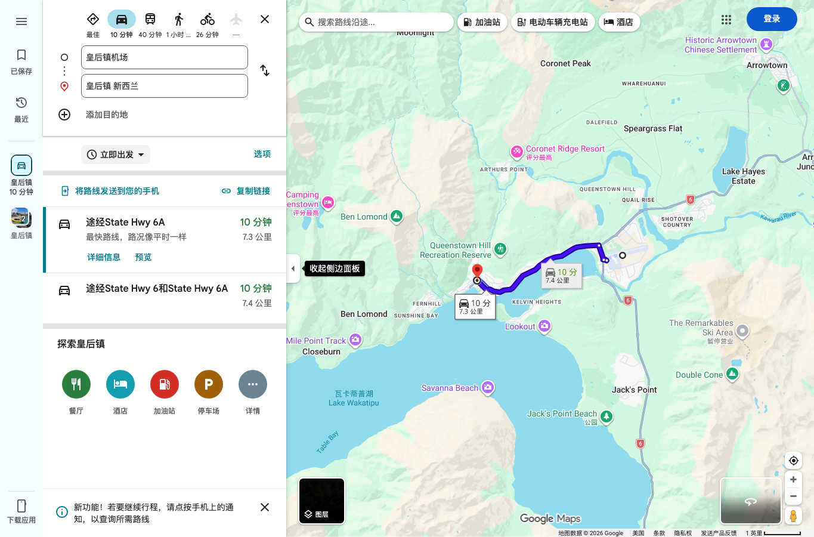 |
| 8/17 Queenstown → Coronet Peak | 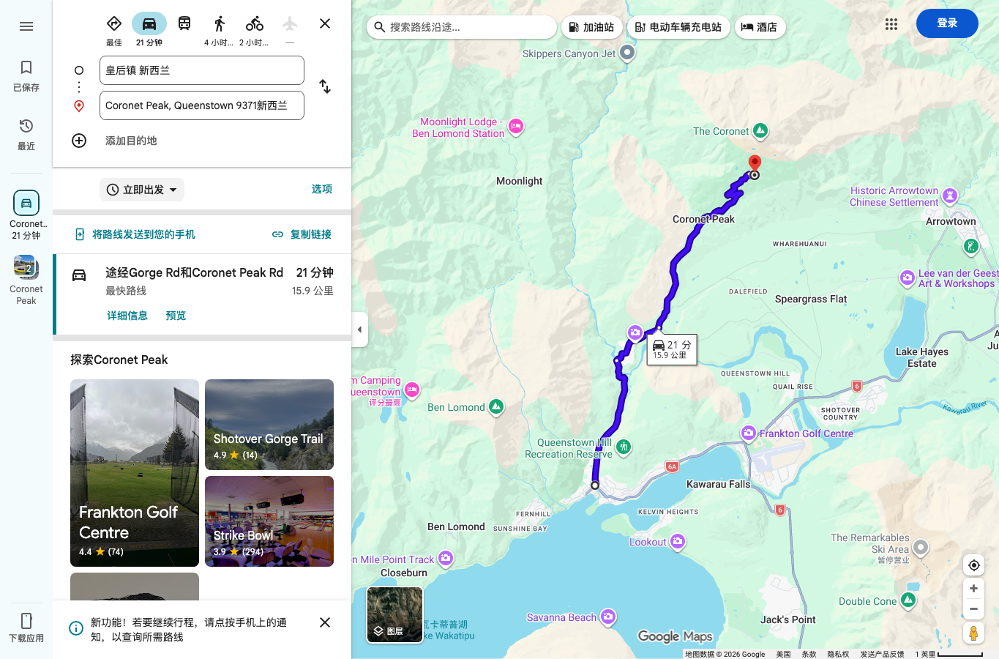 |
| 8/18 Queenstown → The Remarkables | 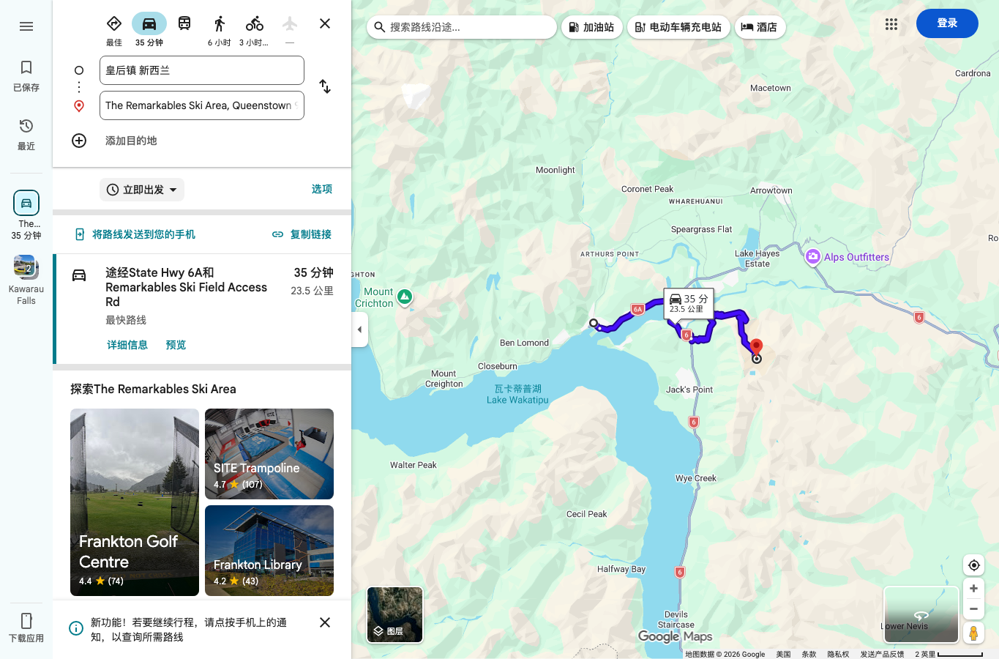 |
| 8/19 Queenstown → Arrowtown → Cardrona Hotel → Wānaka | 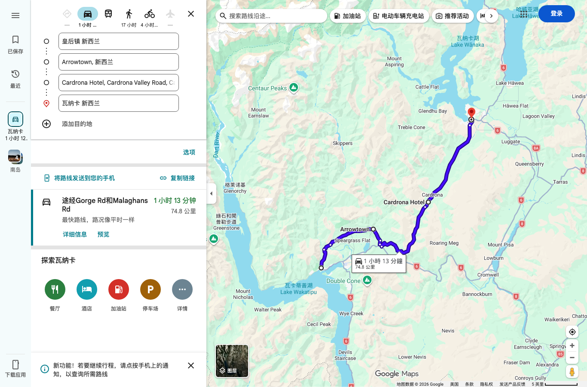 |
| 8/20 Wānaka → Cardrona Alpine Resort | 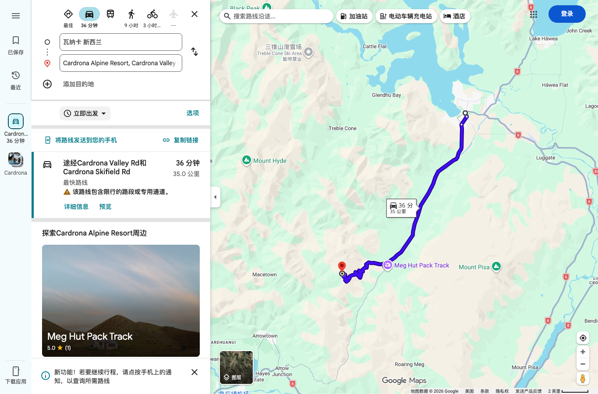 |
| 8/21 Wānaka → Treble Cone | 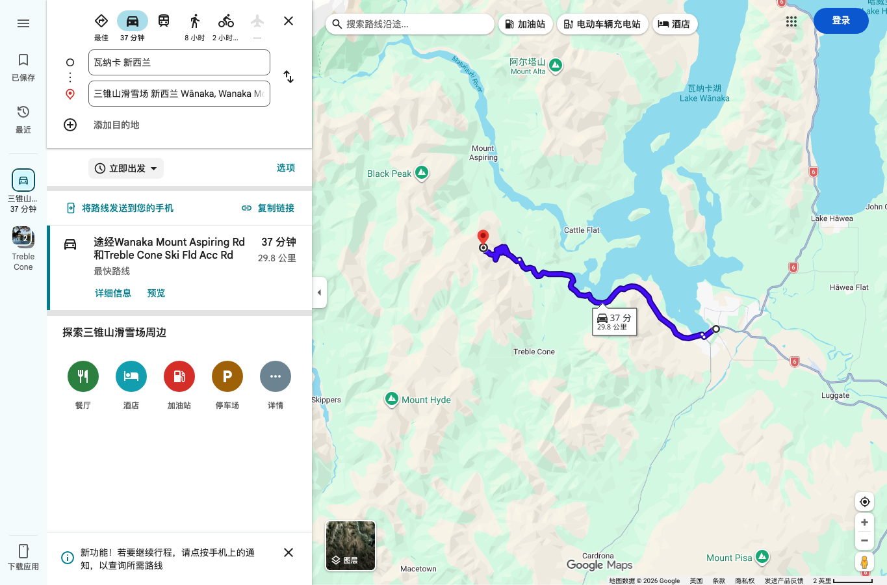 |
| 8/22 Wānaka → That Wānaka Tree → Mount Iron → Onsen → Queenstown | 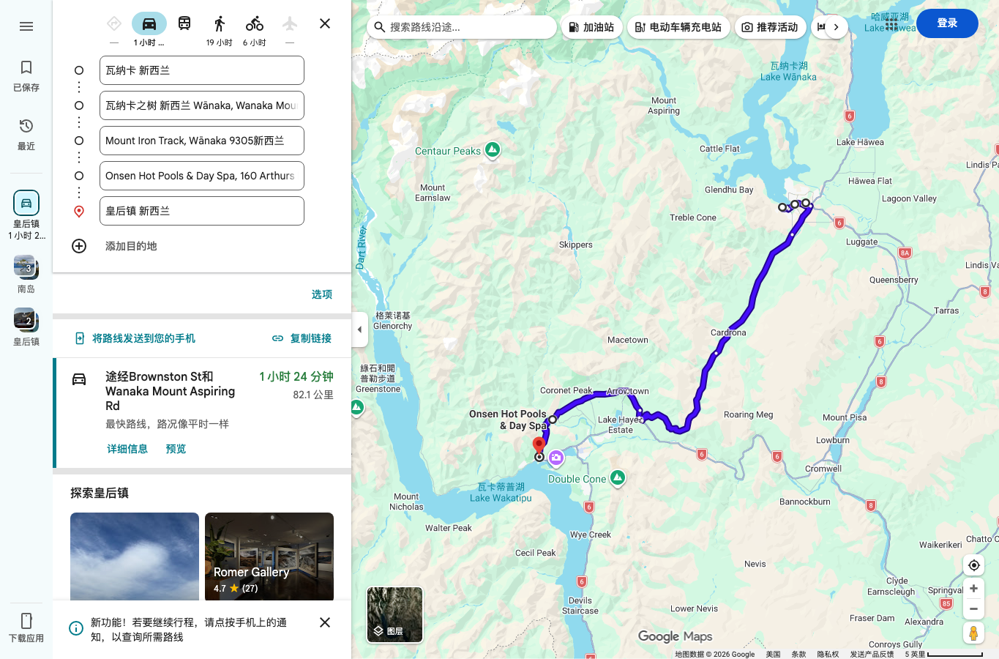 |
| 8/23 Queenstown → Te Anau → Milford Sound | 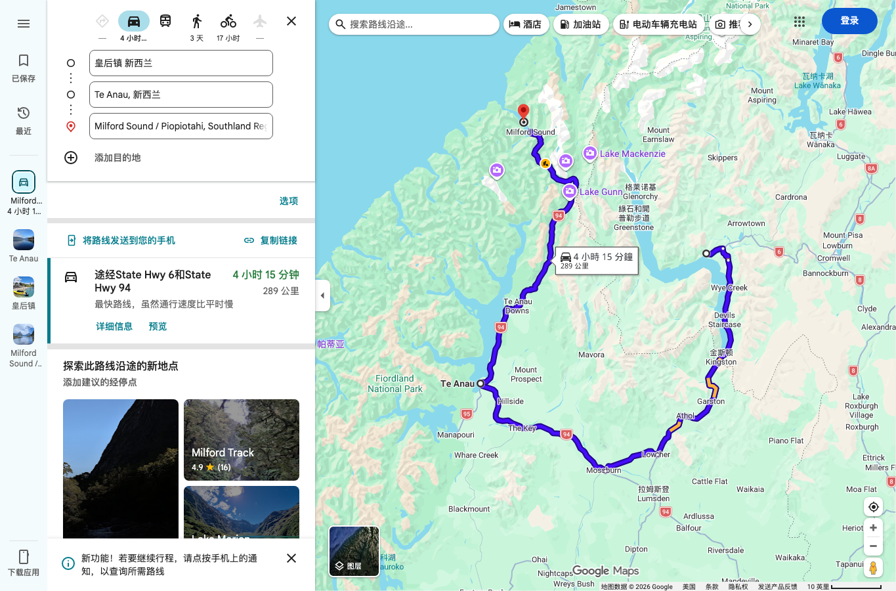 |
| 8/24 Queenstown → Skyline → Queenstown Airport | 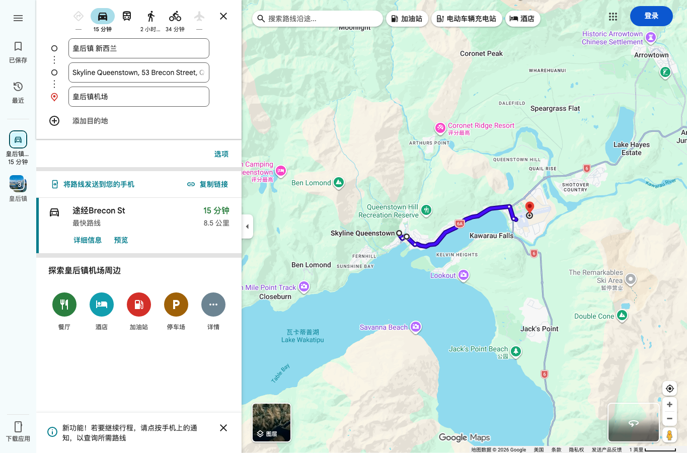 |
| 8/24 Auckland Airport → Airport hotel cluster | 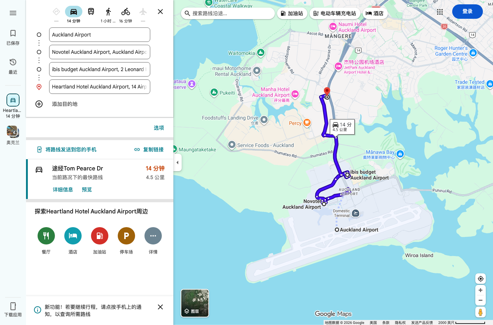 |

### 2.3 住宿周边配套与选择逻辑

| 住宿圈/酒店组 | 周边配套 | 交通便利性 | 适合人群 | 主要取舍 |
|---|---|---|---|---|
| **Queenstown CBD：Holiday Inn Express / Ramada / mi-pad** | 餐厅、酒吧、咖啡、湖边步道、便利店、户外/雪具店集中；步行活动半径最好。 | 去 Coronet Peak、The Remarkables 雪场巴士和 Milford Sound 一日团集合最方便；到机场约 `9 km`。 | 2 人情侣、不自驾、第一次到 Queenstown。 | 房价高、停车贵；房间通常不如公寓宽敞。 |
| **Queenstown CBD 北侧：Creeksyde / Hampshire Lakeview** | 更靠近超市、Skyline、holiday park 自助厨房/洗衣配套；适合采购和洗烘装备。 | 可步行进镇，但部分路段有坡；去雪场巴士/一日团集合点仍比 Frankton 方便。 | 5 人组合、预算控制、需要厨房和洗衣。 | 舒适度和景观不如湖景酒店；房型要确认独立卫浴和床位。 |
| **Frankton / Remarkables Park：Driftaway / Holiday Inn Remarkables Park / Sudima Five Mile** | 机场、超市、商圈、加油、停车和补给更方便；Driftaway 有湖边和自助式住宿优势。 | 去 The Remarkables 比 CBD 更顺；去 Queenstown CBD 吃饭/集合需开车或公交。 | 5 人自驾、带孩子、行李多、重视停车。 | 夜生活和餐厅密度不如 CBD；Milford Sound 一日团集合可能不如市中心方便。 |
| **Wānaka 镇中心：Wanaka Hotel / Archway / Hampshire Wānaka** | 餐厅、咖啡、New World 超市、湖边、药店和滑雪用品店更容易步行解决。 | 去 Cardrona `约 37 km`，去 Treble Cone `约 30 km`；镇中心适合不想每天开车找饭的人。 | 2 人情侣、预算优先、希望晚上步行吃饭。 | 安静度和湖景弱于 Edgewater；部分 motel/holiday park 房型要确认洗烘。 |
| **Wānaka 湖边：Edgewater** | 湖边环境好，离 That Wānaka Tree 更近，适合休整、拍照和滑后放松。 | 去 Wānaka 镇中心需步行较久或短途开车/出租；去 Treble Cone 略顺。 | 情侣舒适版、5 人选 2 卧公寓。 | 不如镇中心吃饭方便；旺季湖边房价容易上去。 |
| **Wānaka 南侧：Oakridge** | 停车、度假设施和家庭公寓更友好，适合自驾和多人。 | 去 Cardrona 方向略顺，但去镇中心吃饭、采购基本需要开车。 | 5 人家庭组、需要大房型和停车。 | 不自驾不推荐；周边步行配套弱。 |
| **Auckland Airport：Novotel / Ibis Budget / Heartland / JetPark** | 机场餐饮、便利店、租车点和航站楼配套为主；Ibis 周边更偏机场商圈，Heartland/JetPark 更依赖接驳。 | Novotel 最适合早班机步行；Ibis/Heartland/JetPark 需看酒店接驳时间或短途出租。 | 回程前一晚所有人。 | 只为过夜和防误机，不建议安排奥克兰市区观光。 |

---

## 3. 官方地图、雪道图与目的地特点

### 地图使用说明

- 本文档优先使用官方雪场/交通地图资源，不再使用普通风景照做介绍。
- 雪道图用于提前理解雪场结构；真正执行时，以雪场官网、App、当天 snow report、lift status 和 road status 为准。
- The Remarkables 与 Treble Cone 的当前官网资源中仍有旧年份文件名；文档会如实标注，不把旧图误写成 2026。

### 南岛动线与小交通地图

*图：NZSki 官方 Queenstown 雪场交通地图。适合理解镇中心、巴士集合点、Coronet Peak、The Remarkables 的关系。来源：NZSki 官方媒体资源。*

| 路段 | 用途 | 推荐方式 | 判断 |
|---|---|---|---|
| Auckland Airport ↔ Queenstown Airport | 国际转南岛 | 国内航班 | 滑雪重点在南岛，不建议长途陆路折腾 |
| Queenstown ↔ Coronet Peak | 第 1 个滑雪日 | NZSki Ski Bus | 距离近，适合热身日 |
| Queenstown ↔ The Remarkables | 第 2 个滑雪日 | NZSki Ski Bus | 山路天气影响更明显，不熟悉冬季山路不建议自驾 |
| Queenstown ↔ Wānaka | 换城与观光 | 2 人坐 SkyDrive；5 人租 7 座车 | 5 人带行李时租车优势明显 |
| Wānaka ↔ Cardrona/Treble Cone | 第 3–4 个滑雪日 | 雪场巴士或租车到山脚接驳 | 以当天道路、雪链和风速为准 |

### Coronet Peak：热身、夜滑、交通最省心

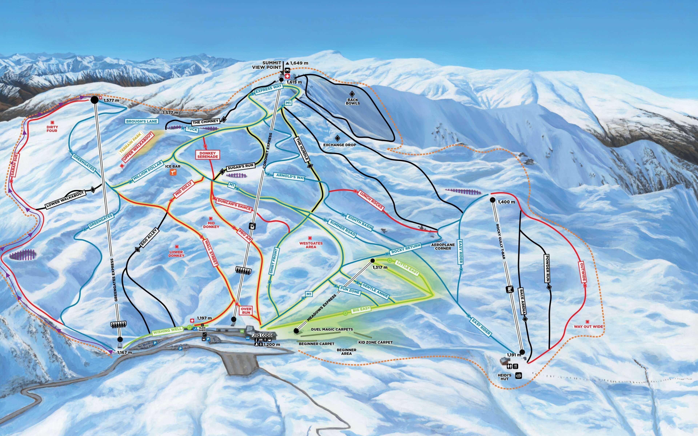

*图：Coronet Peak 官方 2026 trail map。来源：Coronet Peak 官网 Mountain Info 页面。*

**目的地特点**：

- 离 Queenstown 最近，适合抵达后的第一个滑雪日。
- 地形集中，雪道节奏快，初中级都容易找到合适区域。
- 有夜滑选择，但建议根据第一天体力再决定，不要提前排死。

**适合人群**：

- 第一次到新西兰滑雪，需要适应雪具、雪质和雪场动线的人。
- 情侣或家庭中水平不完全一致的组合。
- 需要课程、租赁和交通都尽量简单的人。

**行程执行建议**：

- 8/17 安排这里最稳；早上坐雪场巴士，下午按体力决定是否提前下山。
- 第一趟先检查雪鞋、固定器、板刃和头盔；不要急着冲高难道。
- 若后续天气变差，可把 Coronet Peak 作为补滑备选，因为交通最短。

### The Remarkables：景观强、地形公园和中级体验更突出

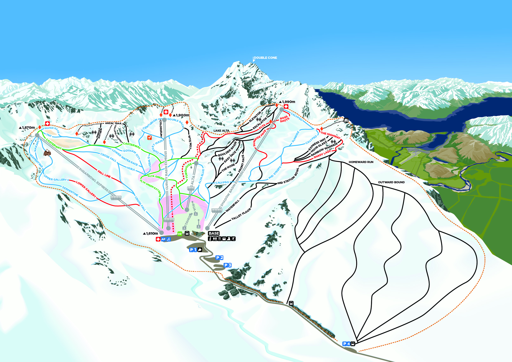

*图：The Remarkables 当前官网页面引用的官方 trail map 图片；PDF 版本也已保存为 `assets/official-maps/remarkables-trail-map-2025.pdf`。来源：The Remarkables 官网 Plan 页面。*

**目的地特点**：

- 高山感更强，景观比 Coronet Peak 更开阔。
- 地形公园、蓝道和拍照体验更突出，适合第二个滑雪日。
- 山路和天气对体验影响更明显，风大时要关注 lift status。

**适合人群**：

- 已经热身过、希望滑得更有变化的中级滑雪者。
- 想兼顾滑雪和拍照的情侣。
- 有一定基础、愿意花时间探索不同雪道区域的人。

**行程执行建议**：

- 8/18 安排这里；前一天完成热身后，第二天体验会更好。
- 家庭组如果孩子水平一般，控制在绿道/蓝道区域，不追求全山打卡。
- 若当天能见度差或风大，优先压缩停留时间，不硬上高处区域。

### Cardrona：家庭友好、宽道多、最适合混合水平团队

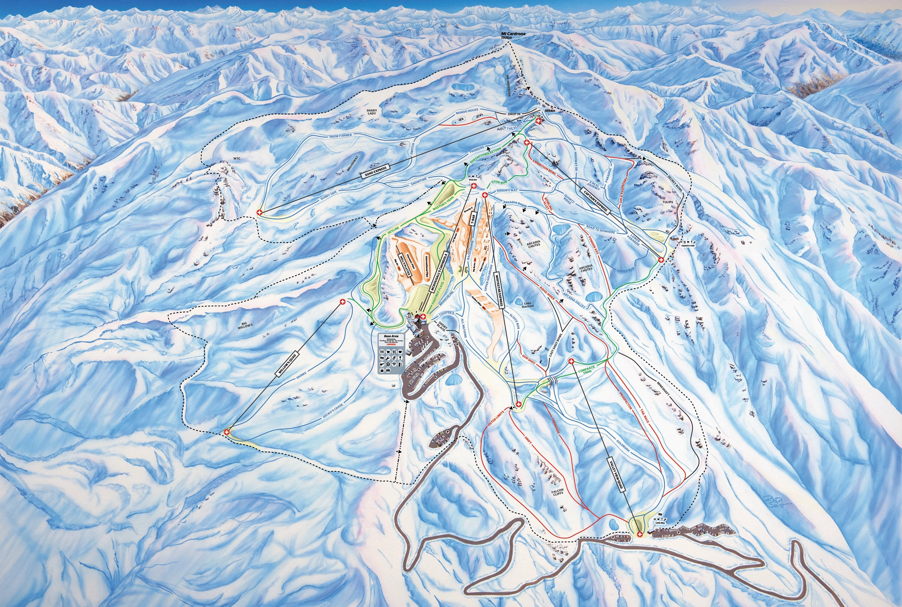

*图：Cardrona 官方 W26 trail map。来源：Cardrona & Treble Cone 官方 Maps 页面。*

**目的地特点**：

- 宽道多、节奏相对温和，教学、租赁、餐饮和公园配套成熟。
- 团队水平不均时，Cardrona 通常比 Treble Cone 更稳。
- 对儿童、初学者、重新恢复滑雪的人更友好，是本行程的家庭主力雪场。

**适合人群**：

- 情侣中一人进阶、一人保守的组合。
- 5 人组合中的儿童或初学者。
- 希望把滑雪体验做扎实，而不是追求高难地形的人。

**行程执行建议**：

- 8/20 固定安排 Cardrona，作为 Wānaka 段第一天。
- 若 8/21 天气差、Treble Cone 风大或团队疲劳，直接把第二天也改成 Cardrona。
- 初学者建议买课程包；不要让会滑的人硬带零基础成员上中级道。

### Treble Cone：中高级优先、风景强，但容错更低

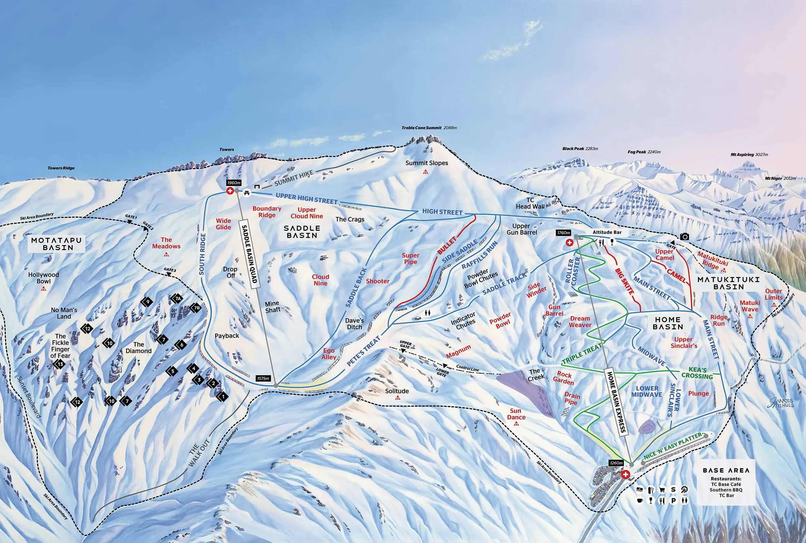

*图：Treble Cone 当前官方 Maps 页面引用的 trail map 资源。来源：Cardrona & Treble Cone 官方 Maps 页面。*

**目的地特点**：

- 更偏中高级，坡道更有山地感，Lake Wānaka 视野强。
- 对初学者不如 Cardrona 友好；天气、能见度和道路状态会显著影响体验。
- 如果团队水平接近且基础好，Treble Cone 的滑行回报高。

**适合人群**：

- 能稳定滑蓝道/红道，想要更长坡道和更强山地感的人。
- 情侣双方水平接近，且愿意接受更高体力消耗。
- 不以儿童和初学者为主的团队。

**不建议人群**：

- 第一次滑雪或刚入门的人。
- 对山路、风、能见度和摔倒容错较低的家庭组。
- 只想轻松拍照、少摔、少走路的人。

**行程执行建议**：

- 8/21 作为“条件满足才执行”的滑雪日。
- 如果天气差，直接改 Cardrona；不要为了打卡 Treble Cone 牺牲安全和体验。
- 5 人组合可分组：高手去 Treble Cone，家庭成员留在 Cardrona，但要提前解决交通衔接。

### 非滑雪目的地特点

| 目的地 | 角色 | 适合安排 | 取舍建议 |
|---|---|---|---|
| Auckland | 国际转机和回程缓冲 | 8/16 转机、8/24 机场过夜 | 不建议占用南岛滑雪时间 |
| Queenstown | 主基地、餐饮、一日游集合点 | 8/16–8/19、8/22–8/24 | 住宿贵，但交通和活动效率最高 |
| Wānaka | Cardrona/Treble Cone 基地 | 8/19–8/22 | 更安静，适合公寓、做饭、洗烘装备 |
| Arrowtown | 换城日短停 | 8/19 中途 45–90 分钟 | 顺路即可，不单独占一天 |
| Cardrona Hotel | 换城日拍照/午餐点 | 8/19 中途 45–75 分钟 | 5 人租车更适合停留 |
| Milford Sound | 南岛核心观光 | 8/23 一日团 | 风景回报高，但费用和时间成本也高 |
| Glenorchy | 低成本观光替代 | 8/23 预算版 | 比 Milford Sound 轻松，适合天气不稳时替代 |

---

## 4. 住宿建议：按每日活动匹配

住宿不是按城市机械切换，而是按 **第二天集合点、雪场通勤、洗烘装备、停车和退房压力** 来选。下表价格为 2026-06-25 可公开读取的“from/近期价/均价”口径，不能替代 2026-08-15–08-25 下单页实时报价；滑雪季和周末建议预留 `20%–40%` 浮动。

### 每日住宿执行表

| 日期 | 当天活动 | 当晚住宿位置 | 2 人情侣推荐 | 5 人组合推荐 | 为什么这样住 | 公开价格参考 |
|---|---|---|---|---|---|---|
| 8/15 周六 | 深圳出发，夜间飞行 | 飞机上 | 不订住宿 | 不订住宿 | 把预算留给南岛，不建议在奥克兰多住一晚 | — |
| 8/16 周日 | AKL 转机到 ZQN；办理交通卡、雪票、雪具 | 皇后镇中心区 | **Holiday Inn Express** 或 **Ramada Queenstown Central**；预算优先选 **mi-pad** | 两间中心区酒店；或 **Hampshire Lakeview / Creeksyde** 这类 holiday park 单元 | 第二天去 Coronet Peak，住中心区方便雪场巴士、晚餐和采购；到达日不要住太偏 | mi-pad `US$83≈¥565`；Ramada `US$131–166≈¥892–1,130`；Holiday Inn Express `US$151–159≈¥1,028–1,083` |
| 8/17 周一 | Coronet Peak 热身滑雪 | 皇后镇中心区 | 继续住同一酒店 | 继续住同一住宿，避免搬行李 | 第一滑雪日结束后需要调整雪具、买缺失装备；同住一处更稳 | 同 8/16；Holiday Inn Express 停车约 `NZD25/天≈¥96` |
| 8/18 周二 | The Remarkables 滑雪 | 皇后镇中心区 | 继续住同一酒店 | 继续住同一住宿 | The Remarkables 山路天气影响更明显，住中心区便于坐官方雪场巴士；晚上餐饮选择最多 | 同 8/16 |
| 8/19 周三 | 换城：Arrowtown、Cardrona Hotel、抵达 Wānaka | Wānaka 湖边/镇中心 | **Wanaka Hotel / Archway / Edgewater**；想拍照和休整选 Edgewater | **Edgewater 2 卧公寓**、**Oakridge Family Apartment**、**Hampshire Wānaka cabin/unit** | 当天不滑雪，适合中途观光；住 Wānaka 是为了接下来两天减少去 Cardrona/Treble Cone 的通勤 | Wanaka Hotel `约US$96起≈¥654`；Archway `US$92起≈¥627`；Edgewater `US$122起≈¥831`；Oakridge 均价 from `US$274≈¥1,866` |
| 8/20 周四 | Cardrona 滑雪 | Wānaka 湖边/镇中心 | 继续住 Wānaka，优先带洗衣/烘干条件 | 继续住公寓/holiday park，晚上做饭、烘装备 | Cardrona 是 Wānaka 段最稳的一天；滑后需要洗烘内层、手套、袜子 | Wānaka 8 月均价约 `US$189/晚≈¥1,287`；Hampshire Wānaka 平均 from `US$94≈¥640` |
| 8/21 周五 | Treble Cone；天气差则改 Cardrona | Wānaka 湖边/镇中心 | 继续住 Wānaka | 继续住 Wānaka | Treble Cone 更吃天气和水平；住 Wānaka 方便临时改 Cardrona，不需要跨城折返 | 同 8/19–8/20 |
| 8/22 周六 | Wānaka 休整 + 返回 Queenstown；可约 Onsen | 皇后镇中心区或 Frankton | 不自驾选 **Ramada / Holiday Inn Express / mi-pad**；自驾可选 Frankton | 有车选 **Driftaway / Hampshire Lakeview / Creeksyde**；想舒适选公寓型酒店 | 次日 Milford Sound 一日游通常从 Queenstown 出发，必须回皇后镇住；当天晚归也要方便吃饭 | Driftaway `US$93–121≈¥633–824`；Hampshire Lakeview `US$98–112≈¥667–763`；Creeksyde `US$112起≈¥763` |
| 8/23 周日 | Milford Sound 大巴 + 游船一日游 | 皇后镇中心区 | 继续住中心区酒店 | 继续住同一住宿 | 一日游早出晚归，住中心区减少集合和晚餐压力；不建议当天换酒店 | Queenstown 8 月均价约 `US$214/晚≈¥1,458` |
| 8/24 周一 | Skyline/湖边/购物；ZQN 飞 AKL | 奥克兰机场 | **Heartland / Ibis Budget / Novotel Auckland Airport** | 两间 **Heartland / JetPark / Ibis**；最省心选 Novotel 两间 | 回程国际段风险最高，最后一晚必须住机场附近；早班机优先 Novotel，预算优先 Ibis/Heartland | Ibis `US$74–75≈¥504–511`；Heartland `US$81–103≈¥552–701`；Novotel `US$124–127≈¥845–865` |
| 8/25 周二 | 奥克兰飞深圳 | — | — | — | 提前 3 小时到国际航站楼 | — |

### 分城市预订建议

| 城市 | 2 人情侣首选 | 5 人组合首选 | 关键设施 | 适合对应日期 |
|---|---|---|---|---|
| 皇后镇中心区 | Ramada Queenstown Central、Holiday Inn Express、mi-pad | 两间 Ramada/Holiday Inn Express；或 Creeksyde / Hampshire Lakeview | 步行吃饭、雪场巴士、洗衣、行李寄存 | 8/16–8/19、8/22–8/24 |
| Queenstown Frankton | Holiday Inn Remarkables Park、Sudima Five Mile | Driftaway、Frankton/Remarkables Park 公寓 | 停车、超市、机场近、去 The Remarkables 顺路 | 5 人自驾组可替代中心区 |
| Wānaka | Wanaka Hotel、Archway、Edgewater | Edgewater 2 卧公寓、Oakridge Family Apartment、Hampshire Wānaka | 厨房、洗衣/烘干、停车、滑雪装备存放 | 8/19–8/22 |
| Auckland Airport | Ibis Budget、Heartland、Novotel | 两间 Heartland/JetPark/Ibis；预算足选 Novotel | 机场接驳/步行、24 小时前台、早班机便利 | 8/24–8/25 |

### 住宿圈地图截图与最低公开价

> 截图生成时间：2026-06-25。截图用于理解住宿圈、生活配套和去目的地路线的相对关系，不代表 2026-08 出行当天实时路况。酒店价格为 2026-06-25 可公开读取的多平台最低价/近 30 天价/平台展示价；部分平台无法直接读取 8/16–8/25 目标日期下单页，因此这里只用于排序和预算，最终预订必须重新输入准确日期、人数、儿童年龄和房型。

#### Queenstown CBD 住宿圈：Holiday Inn Express / Ramada / mi-pad

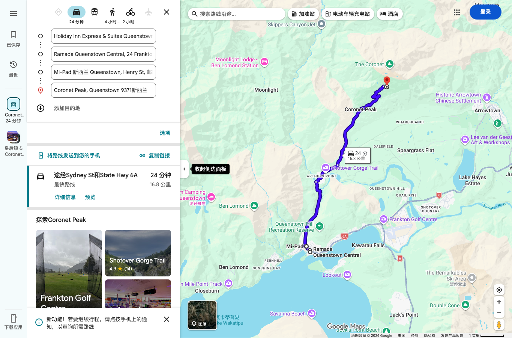

- **生活配套**：餐厅、咖啡、酒吧、湖边步道、雪具店和便利店集中；适合不自驾情侣。
- **去 Coronet Peak**：截图显示从中心区酒店圈串到 Coronet Peak 的路线；建议 8/17 坐 NZSki Ski Bus。
- **去 The Remarkables**：同一住宿圈也可服务 8/18，路线截图如下。

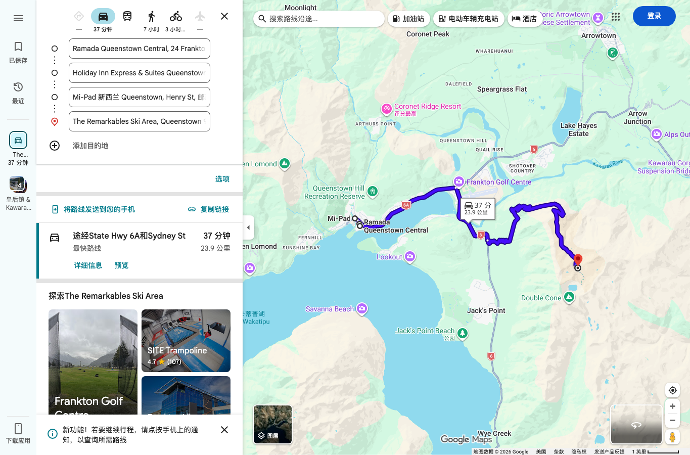

#### Frankton / Remarkables Park 住宿圈：Driftaway / Sudima Five Mile / Holiday Inn Remarkables Park

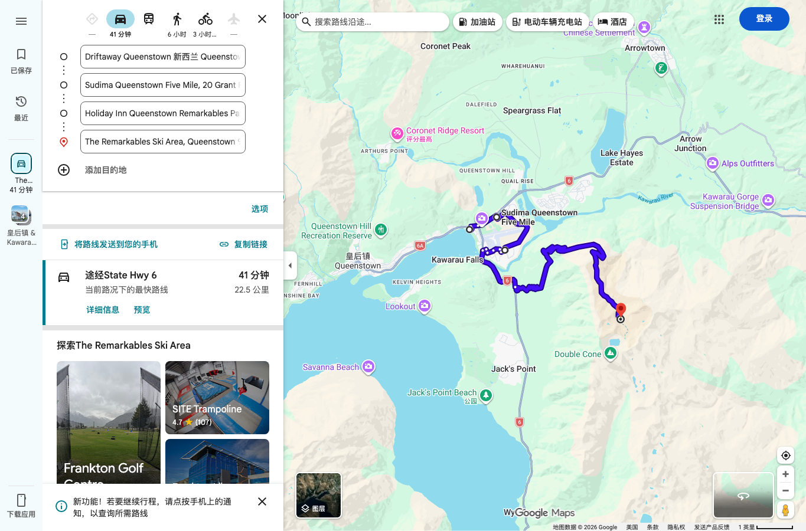

- **生活配套**：机场、Five Mile 商圈、超市、加油、停车和补给更方便。
- **去 The Remarkables**：比 Queenstown CBD 更顺路；适合 5 人自驾组。
- **取舍**：晚餐、湖边散步、Milford Sound 一日团集合不如 Queenstown CBD 方便。

#### Wānaka 镇中心住宿圈：Wanaka Hotel / Archway / Hampshire Wānaka

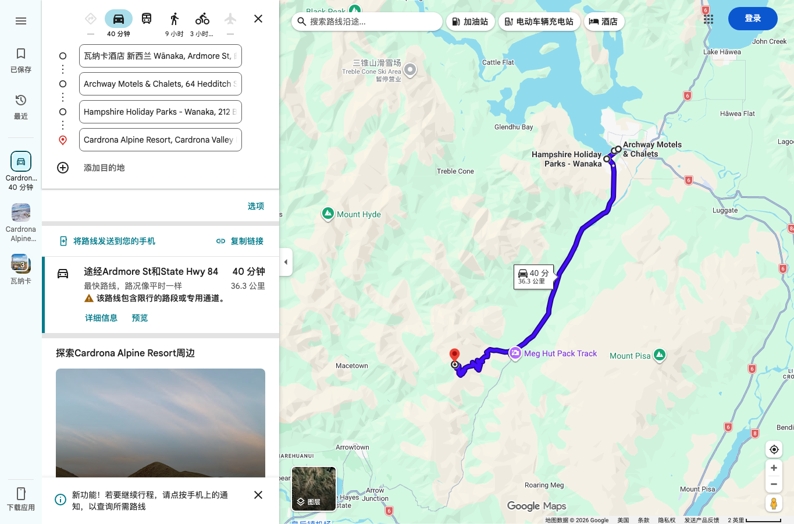

- **生活配套**：餐厅、咖啡、New World 超市、湖边、药店和滑雪用品店更容易步行解决。
- **去 Cardrona**：截图显示从 Wānaka 镇中心住宿圈串到 Cardrona Alpine Resort 的路线；适合 8/20。
- **取舍**：镇中心吃饭方便，但湖景和安静度不如 Edgewater。

#### Wānaka 湖边/南侧住宿圈：Edgewater / Oakridge

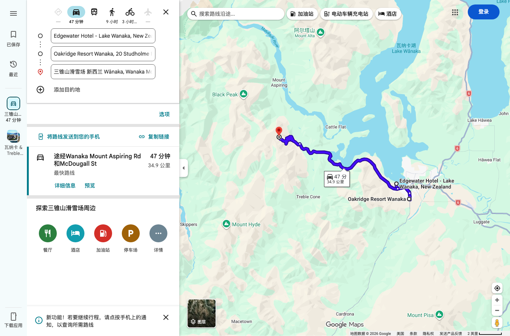

- **生活配套**：Edgewater 湖边体验强，Oakridge 更偏度假公寓和停车；两者都更适合有车或短途打车。
- **去 Treble Cone**：Edgewater 去 Treble Cone 略顺；适合 8/21 中高级日。
- **取舍**：Edgewater 不如镇中心吃饭方便；Oakridge 不自驾不推荐。

#### Auckland Airport 住宿圈：Novotel / Ibis Budget / Heartland / JetPark

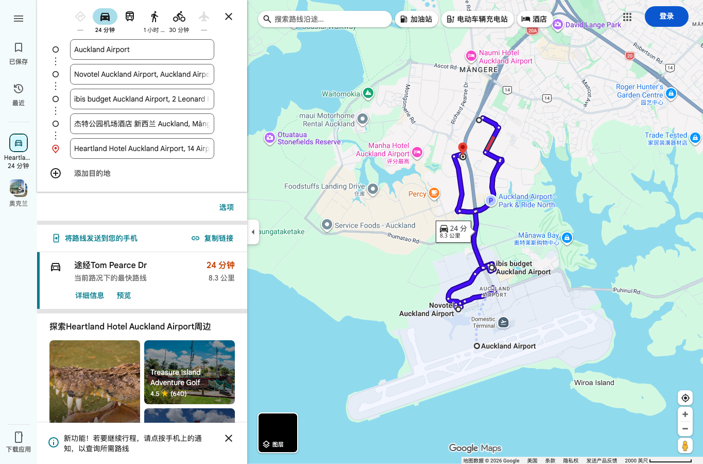

- **生活配套**：机场餐饮、便利店、租车点、酒店接驳和航站楼配套为主。
- **去机场**：Novotel 最省心，适合步行到国际航站楼；Ibis / Heartland / JetPark 需确认接驳或短途出租。
- **取舍**：只为防误机和过夜，不建议这晚安排奥克兰市区观光。

### 各平台比价后的最低公开价

| 地点 | 住宿候选 | 适合场景 | 可读平台对比 | 最低公开价 | 约人民币/晚 | 口径说明 |
|---|---|---|---|---:|---:|---|
| Queenstown CBD | Holiday Inn Express & Suites Queenstown | 2 人性价比、含早餐倾向 | KAYAK `US$99`；Trivago `US$151`；同类页常见 `US$150+` | `US$99` | `¥674` | KAYAK 价通常未含全部现场税费；官方/OTA 下单页需复核 |
| Queenstown CBD | Ramada Queenstown Central | 2 人性价比、位置好 | Expedia/Trivago `US$131–166` | `US$131` | `¥892` | 停车另计，Expedia 显示自助停车约 `NZD30/晚` |
| Queenstown CBD | mi-pad Queenstown | 2 人预算、轻行李 | KAYAK 近两周最低 `US$99`；Expedia 可读设施信息 | `US$99` | `¥674` | 房间偏紧凑，适合不做饭、不带大件雪具 |
| Queenstown CBD 北侧 | Hampshire Queenstown Lakeview | 5 人预算/holiday park | KAYAK `US$66`；Expedia `US$112` | `US$66` | `¥449` | 最低价可能为基础房型；多人需查 cabin/unit |
| Queenstown CBD 北侧 | Queenstown Holiday Park Creeksyde | 5 人预算、厨房洗衣 | Destination Queenstown `from NZD65`；KAYAK `US$221`；第三方站 `US$103` | `NZD65` | `¥250` | `NZD65` 很可能是营位/基础价；多人独立房型通常高很多 |
| Frankton | Driftaway Queenstown | 5 人自驾、停车补给 | Expedia `US$93`；KAYAK `US$116`；官网有冬季连住优惠 | `US$93` | `¥633` | 适合有车，去市中心晚餐不如 CBD 方便 |
| Wānaka 镇中心 | Wanaka Hotel | 2 人性价比 | Trip.com `US$96–102`；Hotels.com 可读同类价 | `US$96` | `¥654` | 镇中心吃饭方便，部分房型无电梯需注意行李 |
| Wānaka 镇中心 | Archway Motels & Chalets | 2 人/家庭厨房 | KAYAK `US$114`；Expedia 可读设施 | `US$114` | `¥776` | 有 motel/chalet 属性，适合自理和停车 |
| Wānaka 湖边 | Edgewater Hotel | 情侣舒适、5 人公寓 | Trip.com / Hotels.com `US$122`；KAYAK `US$161` | `US$122` | `¥831` | 湖边强项，2 卧公寓需按目标日期单独查 |
| Wānaka 南侧 | Oakridge Resort Lake Wānaka | 5 人家庭、公寓/停车 | KAYAK `US$105`；Trip.com `US$109+` / 平均价更高 | `US$105` | `¥715` | 有车更合适；去镇中心吃饭需开车 |
| Wānaka holiday park | Hampshire Wānaka | 预算/家庭厨房 | Trip.com `US$47–59`；NZ 官方 `NZD35–155`；Klook `US$67.87` | `US$47` | `¥320` | 最低价可能为基础 cabin/营地；自带卫浴房型更高 |
| Auckland Airport | ibis budget Auckland Airport | 回程过夜省钱 | Trip.com `US$74–75`；KAYAK `US$88+` | `US$74` | `¥504` | 房间小，但周边机场商圈配套较方便 |
| Auckland Airport | Heartland Hotel Auckland Airport | 机场过夜性价比 | KAYAK `US$85`；Expedia `US$106` | `US$85` | `¥579` | 官方显示距离机场约 3km，提供 24/7 接驳 |
| Auckland Airport | JetPark Hotel Auckland Airport | 机场接驳、家庭友好 | Expedia `US$80`；KAYAK `US$76–81` | `US$76` | `¥518` | 有免费机场接驳，适合两间房方案 |
| Auckland Airport | Novotel Auckland Airport | 早班机最稳 | Trip.com `US$127`；KAYAK `US$138`；Expedia `US$167` | `US$127` | `¥865` | 航站楼旁，贵但最省心 |

**排序结论**：

- **2 人情侣优先**：Queenstown 选 Ramada / Holiday Inn Express，Wānaka 选 Wanaka Hotel 或 Edgewater，Auckland 选 Ibis / Heartland；舒适优先再升级 Novotel。
- **5 人组合优先**：Queenstown 选 Driftaway / Hampshire Lakeview / Creeksyde，Wānaka 选 Edgewater 2 卧或 Oakridge / Hampshire Wānaka，Auckland 选 JetPark / Heartland 两间房。
- **不要只按最低价订**：最低公开价常对应营位、共享卫浴、无早餐、不可取消或小房型；滑雪行程更应优先看洗衣烘干、停车、厨房、接驳和取消政策。

### 2 人情侣住宿组合

| 档位 | Queenstown 5 晚 | Wānaka 3 晚 | Auckland Airport 1 晚 | 9 晚房费估算 |
|---|---|---|---|---:|
| 控预算 | mi-pad / Haka House 私享房 | Wanaka Hotel / Haka House | Ibis Budget | `¥5,300–7,500/间` |
| 性价比推荐 | Ramada / Holiday Inn Express | Wanaka Hotel / Archway / Edgewater 普通房 | Heartland / Ibis | `¥8,500–12,000/间` |
| 舒适版 | Holiday Inn Express / Crowne Plaza | Edgewater 湖边房或套房 | Novotel Auckland Airport | `¥12,000–17,000/间` |

**情侣选择建议**：如果不自驾，皇后镇优先中心区，Wānaka 优先镇中心或湖边；不要为了每晚省 `¥200–300` 住得过偏，否则雪场巴士、晚餐和行李转移会损耗体验。

### 5 人组合住宿组合

| 档位 | Queenstown 5 晚 | Wānaka 3 晚 | Auckland Airport 1 晚 | 9 晚团队房费估算 |
|---|---|---|---|---:|
| 控预算 | Holiday park 两个单元 / 两间经济酒店 | Hampshire Wānaka / 带厨房 cabin | 两间 Ibis/Heartland | `¥11,500–16,000/组` |
| 性价比推荐 | Creeksyde / Hampshire Lakeview / Driftaway | Edgewater 或 Oakridge 家庭公寓 | 两间 Heartland/JetPark | `¥15,000–25,000/组` |
| 舒适版 | Queenstown 公寓型酒店 / 两间 4 星酒店 | Edgewater 2 卧公寓 | 两间 Novotel | `¥25,000+/组` |

**5 人选择建议**：优先订带厨房、洗衣、烘干和停车的 apartment 或 holiday park unit。滑雪服、保暖层、手套和袜子每天都要烘干；对家庭组来说，洗烘和厨房通常比湖景更重要。

---

## 5. 新西兰小交通方案

### 机场与内陆航班

- `AKL ↔ ZQN` 建议买含托运行李的票。
- 奥克兰机场国际/国内航站楼之间有免费接驳巴士，官方说明约每 15 分钟一班，运营时段覆盖大部分白天航班。
- Air New Zealand 国内航班常规值机关闭时间为起飞前 30 分钟；如果接国际航班或带大件行李，按更保守时间到机场。
- 若自带雪板/雪具，Air New Zealand 对 2 米以内、23kg 以内的运动器材可按标准托运行李计。

### 皇后镇市内

- 建议到达第一天购买 Bee Card。
- Queenstown Orbus 成人 Bee Card 票价为 `NZD 2.50/次`；机场线成人现金价更高。
- 酒店选镇中心或靠主公交线，能显著降低打车成本。

### Queenstown ↔ Wānaka

- 情侣推荐 SkyDrive/Ritchies shuttle，官方/目的地信息显示均价约 `NZD 42.50/人/程`，每天多班。
- 5 人组合建议 8/19 开始租 7 座车，主要用于换城、观光和最后回皇后镇机场。

### 雪场交通

| 雪场 | 推荐交通 | 说明 |
|---|---|---|
| Coronet Peak | 雪场巴士 | 离皇后镇近，第一天不建议自驾上山 |
| The Remarkables | 雪场巴士 | 山路更需要看天气，巴士省心 |
| Cardrona | 雪场巴士或自驾到山脚接驳 | 家庭出行可根据天气决定 |
| Treble Cone | 雪场巴士或自驾到山脚接驳 | 中高级日，天气差就改 Cardrona |

**5 人租车注意**：

- 不建议租 5 座 SUV：5 人 + 大行李 + 雪具很容易放不下。
- 推荐 7 座车或 people mover。
- 冬季去雪场必须关注道路状态和雪链要求；不熟悉雪地山路时，宁可坐雪场巴士。
- 租车预算按 `NZD 1,900–2,900/团` 预留，含 6 天 7 座车、基础保险、燃油、停车、雪链等浮动成本。

---

## 6. 预算总览（人民币）

### 2 人情侣

| 项目 | 人均预算 | 2 人合计 | 说明 |
|---|---:|---:|---|
| 新西兰访客签证 | `¥1,715` | `¥3,430` | INZ Visitor Visa from `NZD 441` |
| 深圳 ↔ 奥克兰国际机票 | `F` | `2F` | 按实际看到价格填入 |
| 奥克兰 ↔ 皇后镇国内机票 | `¥1,200–1,800` | `¥2,400–3,600` | 建议买含托运行李 |
| 住宿 9 晚 | `¥4,200–6,700` | `¥8,400–13,400` | 双人间平摊 |
| 4 天滑雪：雪票+租赁+雪场交通 | `¥4,400–4,900` | `¥8,800–9,800` | 不含服装租赁 |
| 餐饮 | `¥2,300–3,500` | `¥4,600–7,000` | 简餐 + 普通餐厅混合 |
| 新西兰小交通 | `¥700–1,000` | `¥1,400–2,000` | Bee Card、SkyDrive、机场交通等 |
| Milford Sound + 其他观光 | `¥1,100–1,900` | `¥2,200–3,800` | Milford 为主要大项 |
| 保险/杂费 | `¥800–1,200` | `¥1,600–2,400` | 保险需覆盖滑雪 |
| **合计，不含国际机票** | **`¥16,500–22,000`** | **`¥33,000–44,000`** |  |
| **合计，含国际机票** | **`¥16,500–22,000 + F`** | **`¥33,000–44,000 + 2F`** |  |

### 5 人组合（4 成人 + 1 儿童）

| 项目 | 团队预算 | 说明 |
|---|---:|---|
| 新西兰访客签证 | `¥8,575` | 按 5 人各 `NZD 441` 粗算 |
| 深圳 ↔ 奥克兰国际机票 | `5F` | 按实际票价填入 |
| 奥克兰 ↔ 皇后镇国内机票 | `¥6,000–9,000` | 5 人，含托运行李更稳 |
| 住宿 9 晚 | `¥15,000–26,500` | 2 房公寓/holiday park unit/两间房 |
| 南岛小交通 | `¥7,400–11,300` | 7 座车 6 天 + 燃油/停车/雪链 + 部分雪场巴士 |
| 4 天滑雪：雪票+租赁+交通 | `¥18,500–21,500` | 儿童价格以最终预订页为准 |
| 餐饮 | `¥9,000–13,200` | 可通过公寓做饭降低 |
| Milford Sound + 其他观光 | `¥5,200–7,000` | RealNZ 成人/儿童价粗算 |
| 保险/杂费 | `¥2,500–5,000` | 5 人团队预留 |
| **合计，不含国际机票** | **`¥72,000–102,000`** |  |
| **合计，含国际机票** | **`¥72,000–102,000 + 5F`** |  |

---

## 7. 预订清单

### 第一优先级

1. 确认护照有效期和新西兰 Visitor Visa。
2. 锁定 `深圳 ↔ 奥克兰` 国际机票价格。
3. 购买 `AKL ↔ ZQN` 国内机票，优先选择同一航空公司/足够转机时间。
4. 订可取消住宿：
   - Queenstown：8/16–8/19
   - Wānaka：8/19–8/22
   - Queenstown：8/22–8/24
   - Auckland Airport：8/24–8/25

### 第二优先级

1. NZSki 购买 `2 天 Superpass`，用于 Coronet Peak + The Remarkables。
2. Cardrona/Treble Cone 购买 `2 天 multi-day pass` 或 `lift + rental combo`。
3. 预订雪场巴士或确认租车雪链政策。
4. 预订 Milford Sound 一日团。
5. 预订旅行保险，必须覆盖滑雪/雪板运动、医疗、航班延误和行李。

### 出发前 24 小时内

1. 填写 New Zealand Traveller Declaration，每位旅客包括儿童都需要提交。
2. 查看四个雪场 snow report 和道路状态。
3. 根据天气决定是否将 Treble Cone 改为 Cardrona，或把 8/22 用作补滑日。

---

## 8. 装备建议

### 建议自带

- 滑雪服/冲锋衣、雪裤
- 手套或连指手套
- 雪镜
- 速干内衣和保暖中层
- 羊毛袜/滑雪袜
- 护脸、脖套、防晒霜、润唇膏
- 护具：护臀、护膝、护腕

### 可当地租

- 雪板/双板
- 雪鞋
- 头盔
- 雪杖

### 不建议现场临时买

- 合脚的滑雪袜
- 贴身保暖层
- 舒适手套
- 护具

原因：雪场和镇上可以买到，但价格高、尺码不稳定，临时购买会浪费第一天滑雪时间。

---

## 9. 常见 Q&A

### Q1：为什么不直接住皇后镇全程？

可以，但会牺牲性价比和通勤体验。Cardrona 和 Treble Cone 更靠近瓦纳卡；住瓦纳卡 3 晚能减少往返时间，也能体验更安静的湖区。

### Q2：Treble Cone 是否适合儿童或初学者？

不作为首选。Treble Cone 更适合中高级；如果团队水平不均，8/21 可以改为 Cardrona 第二天，整体体验更稳。

### Q3：2 人情侣是否需要租车？

不建议。皇后镇停车、雪场山路、雪链和冬季天气都会增加成本和风险。2 人使用公交、SkyDrive 和雪场巴士更省心。

### Q4：5 人一定要租车吗？

不是一定，但推荐 8/19–8/24 租 7 座车。它主要解决换城、行李、观光和家庭灵活性；雪场上山当天仍可根据天气改坐雪场巴士。

### Q5：如果天气不好怎么办？

8/22 和 8/24 上午都留有缓冲。实际执行时每天早上看 snow report：风大或道路差时，优先改 Cardrona、Coronet Peak 或室内/镇区活动。

### Q6：要不要买 5 天雪票？

第一次去不建议一开始买死 5 天。先按 4 天滑雪规划，8/22 作为补滑/休息。若状态好，再现场或提前补第 5 天。

### Q7：是否需要滑雪课程？

如果是初学者，建议第一天在 Coronet Peak 或 Cardrona 买课程包。不要让会滑的人直接带零基础新手上中级道，效率低且容易受伤。

### Q8：国际段和新西兰国内段能否当天衔接？

到达日可以，但要留足入境、取行李、重新托运和换航站楼时间。回程不建议当天从皇后镇飞奥克兰接国际航班，所以安排 8/24 住奥克兰机场。

### Q9：新西兰签证要提前多久办？

建议至少提前 2–3 个月开始。INZ 显示 Visitor Visa 费用从 `NZD 441` 起，且需要资金证明、离境证明等材料。

### Q10：旅行保险怎么选？

必须覆盖滑雪/单板运动、医疗救援、航班延误、行李延误和取消损失。注意有些保险把滑雪列为高风险运动，需要额外购买运动保障。

---

## 10. 备选方案

### 省钱版

- Milford Sound 改为 Glenorchy + Arrowtown。
- 皇后镇住宿改 Haka House 私享房或 holiday park cabin。
- 瓦纳卡住 holiday park cabin 或公寓做饭。
- 滑雪控制在 4 天，不加夜滑。

### 舒适版

- 皇后镇住中心区 4 星酒店。
- 瓦纳卡住 Edgewater 湖景房或 2 房公寓。
- 8/22 安排 Onsen Hot Pools。
- 8/23 Milford Sound 选择含更舒适座位或小团产品。

### 滑雪强化版

- 8/22 改为 Cardrona 第三天。
- Milford Sound 取消或改为更短的 Glenorchy。
- 前提是团队体力好，且天气稳定。

---

## 11. 官方地图来源与使用说明

本文档的地图和雪道图优先使用官方雪场/交通页面资源，并以本地文件形式保存在 `assets/official-maps/` 下。地图仅用于个人行程规划；外部公开分享或商业使用前，应再次核对各雪场官网的版权和使用条款。出发前请重新打开官方页面确认是否已更新为 2026 最新版本。

| 本地文件 | 内容 | 官方来源 |
|---|---|---|
| `assets/official-maps/nzski-queenstown-transport-map.jpg` | NZSki Queenstown 雪场交通地图 | The Remarkables 官方 Plan 页面 / NZSki 媒体资源 |
| `assets/official-maps/coronet-peak-trail-map-2026.jpeg` | Coronet Peak 2026 雪道图 | <https://www.coronetpeak.co.nz/mountain-info> |
| `assets/official-maps/remarkables-trail-map-2025.jpg` | The Remarkables 当前官网引用雪道图图片 | <https://www.theremarkables.co.nz/plan> |
| `assets/official-maps/remarkables-trail-map-2025.pdf` | The Remarkables 当前官网引用雪道图 PDF | <https://www.theremarkables.co.nz/plan> |
| `assets/official-maps/cardrona-trail-map-w26.webp` | Cardrona W26 雪道图 | <https://cardrona-treblecone.com/mountains/maps> |
| `assets/official-maps/treble-cone-trail-map-w24.webp` | Treble Cone 当前官网引用雪道图 | <https://cardrona-treblecone.com/mountains/maps> |

## 12. 主要信息来源

检索日期：雪票/交通 2026-06-21；住宿与汇率 2026-06-25。

- Queenstown 官方滑雪信息：<https://www.queenstownnz.co.nz/things-to-do/skiing-and-snowboarding/>
- Queenstown 雪况与预报：<https://www.queenstownnz.co.nz/things-to-do/skiing-and-snowboarding/snow-reports-and-forecasts/>
- Coronet Peak Mountain Info / Trail Map：<https://www.coronetpeak.co.nz/mountain-info>
- The Remarkables Plan / Trail Map：<https://www.theremarkables.co.nz/plan>
- Coronet Peak / NZSki Superpass：<https://www.coronetpeak.co.nz/all-passes>
- Coronet Peak 租赁：<https://www.coronetpeak.co.nz/all-rentals>
- Cardrona & Treble Cone 官方 Maps：<https://cardrona-treblecone.com/mountains/maps>
- Cardrona & Treble Cone 雪票：<https://cardrona-treblecone.com/passes/lift-passes>
- Cardrona & Treble Cone 交通：<https://cardrona-treblecone.com/mountains/transport>
- Cardrona & Treble Cone 雪季说明：<https://cardrona-treblecone.com/blog/new-zealand-ski-season>
- Orbus Queenstown 票价：<https://www.orc.govt.nz/orbus/fares/>
- Auckland Airport 公共交通：<https://www.aucklandairport.co.nz/transport/public-transport>
- SkyDrive Queenstown–Wānaka shuttle：<https://www.skydrive.co.nz/queenstown/>
- Trip.com Queenstown 酒店价格与 8 月均价：<https://www.trip.com/hotels/queenstown-hotels-list-3860/>
- Trivago Queenstown 住宿比价：<https://www.trivago.com/en-US/odr/hotels-queenstown-new-zealand?search=200-61352>
- KAYAK Holiday Inn Express Queenstown 比价：<https://www.kayak.com/Queenstown-Hotels-Holiday-Inn-Express-Suites-Queenstown.5921959.ksp>
- Expedia Ramada Queenstown Central 价格与停车信息：<https://www.expedia.com/Queenstown-Hotels-Ramada-By-Wyndham-Queenstown-Central.h37408030.Hotel-Information>
- KAYAK mi-pad Queenstown 比价：<https://www.kayak.com/Queenstown-Hotels-Mi-Pad-Smart-Hotel.3990296.ksp>
- KAYAK Hampshire Queenstown Lakeview 比价：<https://www.kayak.com/Queenstown-Hotels-Hampshire-Holiday-Parks---Queenstown-Lakeview.426468.ksp>
- Destination Queenstown Creeksyde 官方列表：<https://www.queenstownnz.co.nz/listing/queenstown-holiday-park-creeksyde/1603/>
- Expedia Driftaway Queenstown 价格：<https://www.expedia.com/Queenstown-Hotels-Driftaway-Queenstown.h120534542.Hotel-Information>
- Trip.com Wānaka 酒店价格与 8 月均价：<https://www.trip.com/hotels/wanaka-hotels-list-3992/>
- Trip.com Edgewater Hotel Wānaka：<https://us.trip.com/hotels/wanaka-hotel-detail-2198195/edgewater-hotel-wanaka/>
- KAYAK Oakridge Resort Lake Wānaka 比价：<https://www.kayak.com/Wanaka-Hotels-Oakridge-Resort-Lake-Wanaka.156532.ksp>
- Trip.com Hampshire Holiday Parks Wānaka：<https://www.trip.com/hotels/wanaka-hotel-detail-9029950/wanaka-lakeview-holiday-park/>
- NewZealand.com Hampshire Wānaka 官方价格范围：<https://www.newzealand.com/us/plan/business/wanaka-lakeview-holiday-park/>
- Trip.com Auckland Airport 周边酒店价格：<https://www.trip.com/hotels/auckland-auckland-international-airport/hotels-c678a4325424/>
- KAYAK Heartland Hotel Auckland Airport 比价：<https://www.kayak.com/Mangere-Hotels-Heartland-Hotel-Auckland-Airport.308171.ksp>
- KAYAK JetPark Hotel Auckland Airport 比价：<https://www.kayak.com/Auckland-Hotels-Jet-Park-Hotel-Conference-Centre.4244.ksp>
- Expedia JetPark Hotel Auckland Airport 价格：<https://www.expedia.com/Auckland-Hotels-Jet-Park-Hotel-Auckland-Airport.h522358.Hotel-Information>
- Holiday Inn Express & Suites Queenstown 官方酒店信息：<https://www.ihg.com/holidayinnexpress/hotels/us/en/queenstown/zqnqt/hoteldetail>
- Immigration New Zealand Visitor Visa：<https://www.immigration.govt.nz/visas/visitor-visa/>
- 中国公民 Visitor Visa 申请指南：<https://www.immigration.govt.nz/process-to-apply/applying-for-a-visa/providing-evidence-and-documents-to-support-your-visa-application/visitor-visa-application-guide-for-citizens-of-china/>
- New Zealand Traveller Declaration：<https://www.travellerdeclaration.govt.nz/>
- RealNZ Milford Sound Day Trip：<https://www.realnz.com/en/experiences/day-cruises/milford-sound-day-trip-from-queenstown/>
- Wise USD/CNY 汇率：<https://wise.com/us/currency-converter/usd-to-cny-rate/history>
- Wise NZD/CNY 汇率：<https://wise.com/us/currency-converter/nzd-to-cny-rate/history>
